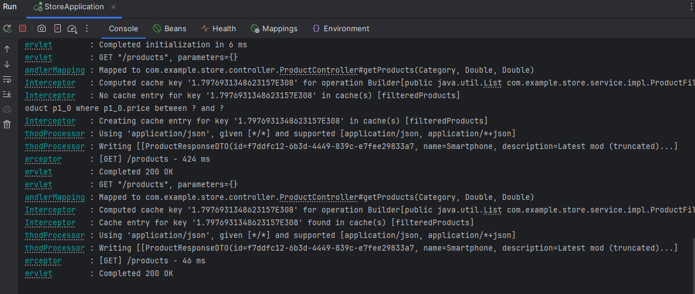
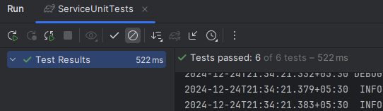
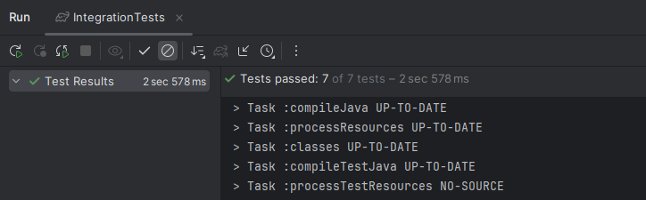

# Store
SpringBoot Project With Caching

DB - Postgres
Cache - Redis

Steps to run:

1. Setup postgres and Redis
2. Update db and cache connection configuration in application.yaml
3. Run the application 
4. OpenAPI doc - http://localhost:8080/swagger-ui/index.html

Postman collection added - Store APIs.postman_collection.json

Health - http://localhost:8080/actuator/health
Metrics - http://localhost:8080/actuator/metrics
Cache - http://localhost:8080/actuator/caches
http://localhost:8080/actuator/metrics/cache.hits

Features:

APIs, Caching, Actuator, Metrics, Interceptor, Exception Handling, Unit Tests, 
Integration Tests, OpenAPI doc

Logging Caching Details (Miss/Hits), response time

Test passing

